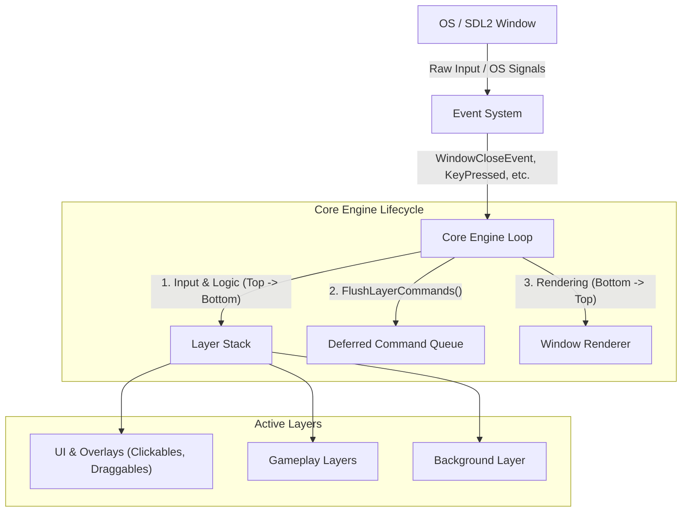

# SimpleGameEngine

[](https://en.cppreference.com/w/cpp/23)
[](https://cmake.org/)
[](https://www.libsdl.org/)

A modular, lightweight 2D game engine written in modern C++23 and SDL2, inspired by [The Cherno's Hazel Engine](https://github.com/TheCherno/Hazel). 

The engine cleanly separates windowing and platform operations from core game logic using a decoupled layer stack, a type-safe compile-time event dispatcher, and an extensible component-based UI framework.

## Architecture overview



### Key architectural highlights
* **Deferred command queue (`FlushLayerCommands`):** Pushing, popping, or focusing layers during frame execution is deferred to safe sync points, preventing iterator invalidation.
* **Dual-direction iteration:** 
  - **Logic & input:** Processed from top to bottom so UI and modals get first priority to handle and consume input events.
  - **Rendering:** Processed from bottom to top using C++23 ranges (`std::views::reverse`) ensuring proper painter's algorithm depth ordering.
* **Compile-time event dispatching:** Type-safe event subscription leveraging `static_assert` and C++ type traits (`std::is_invocable_r_v`, `std::is_base_of_v`).
* **Callback-driven UI composition:** Interactive UI components (`Clickable`, `Draggable`) utilize stateful lambdas and callback composition for behavioral logic, eliminating the need for users to write boilerplate subclasses for every widget.

## Quick example

```cpp
#include "engine/core/core.h"
#include "engine/core/layer.h"

class GameLayer : public Layer {
public:
    LAYER_CLASS_TYPE(mainLayer)

    void OnUpdate(double dt) override {
        // Frame logic updated with delta time
    }

    void OnEvent(const Event& event) override {
        EventDispatcher dispatcher(event);
        dispatcher.Dispatch<KeyPressedEvent>([](const KeyPressedEvent& e) {
            // Handle key press
            return true; // Mark as handled
        });
    }

    void OnRender() override {
        // Draw scene elements
    }
};

int main() {
    WindowSettings settings;
    settings.width = 1600;
    settings.height = 900;
    settings.targetFps = 144;

    Core engine(settings);
    engine.RegisterLayer(std::make_unique<GameLayer>());
    engine.Run();

    return 0;
}
```

## Features

### Event system
Supported events include:
* **Window:** `WindowCloseEvent`, `WindowMinimizedEvent`, `WindowRestoredEvent`
* **Keyboard:** `KeyPressedEvent`, `KeyReleasedEvent`
* **Mouse:** `MouseMovedEvent`, `MouseButtonPressedEvent`, `MouseButtonReleasedEvent`

### UI framework
* `Clickable`: Reactive UI elements supporting hover, click, held, release, and cancel states.
* `Draggable`: Extends clickable components with smooth translation, hold timers, and drag threshold detection.

## Building from source

### Prerequisites
* CMake $\ge$ 3.26
* C++23 compliant compiler (GCC 13+, Clang 16+, or MSVC 2022+)
* *Note:* All core third-party dependencies (`SDL2`, `SDL2_image`, `SDL2_mixer`) are automatically fetched and built via CMake `FetchContent`—no manual library installations required.

### Build steps

```bash
# 1. Clone the repository
git clone https://github.com/Tudor0-0/SimpleGameEngine.git
cd SimpleGameEngine

# 2. Configure with CMake
cmake -B build -DCMAKE_BUILD_TYPE=Release

# 3. Build the project
cmake --build build -j$(nproc)

# 4. Run the executable
./build/SimpleGameEngine
```